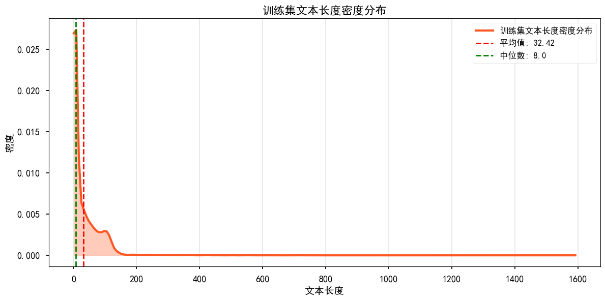
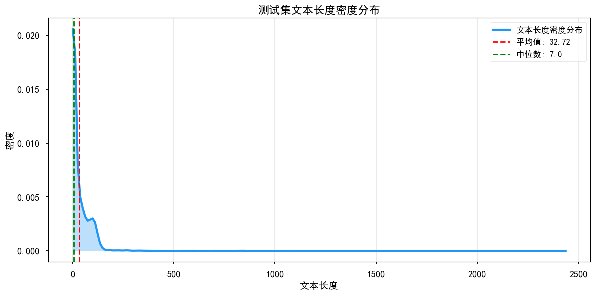

### 基于文本的违禁词分类挑战赛
#### 1.前置数据分析
  - 任务描述：本质上是一个十分类的不均衡样本数据集，采用Macro F1-score进行模型评价
  - 数据分析：
    一、文字类别与数量对应结果
    | 序号 | 文字类别                     | 对应数量 |
    |------|------------------------------|----------|
    | 0    | 地域歧视                     | 3106     |
    | 1    | 基于外表的刻板印象(SA)       | 31       |
    | 2    | 基于文化背景的刻板印象(SCB)  | 776      |
    | 3    | 宗教迷信                     | 241      |
    | 4    | 微侵犯(MA)                   | 1594     |
    | 5    | 性侵犯(SO)                   | 71       |
    | 6    | 政治敏感                     | 7084     |
    | 7    | 犯罪                         | 1145     |
    | 8    | 种族歧视                     | 4488     |
    | 9    | 色情                         | 6564     |

    二、文本数据的长度分布
    
    
    
    - 分布一致性：训练集与测试集的文本长度分布趋势高度一致，无明显偏移或异常差异，说明两类数据集在文本长度特征上具有良好的一致性，可减少因数据分布差异对模型训练与泛化效果的影响。

    - 样本长度特征：两类数据集的文本均以短样本为主，长文本占比极低，整体长度集中在小区间内。

    - 基于 “以短样本为主” 的特征，在模型输入处理阶段，无需进行大量截断（truncation）操作，针对少数长文本数据，结合本次比赛策略，采用BERT系列模型作为基模型，通过 “截取头部 128 个 token + 尾部 382 个 token” 的截断方式，在控制输入长度符合模型限制，兼顾文本首尾关键信息的保留，平衡信息完整性与模型输入要求。

#### 2. 模型设置
##### 2.1 基础配置
| 配置类别       | 具体参数                                                                 |
|----------------|--------------------------------------------------------------------------|
| 基础模型选择   | chinese-roberta-wwm-ext|
| 模型结构优化   | 拼接BERT模型最后5层输出结果，作为分类器输入|
| 计算设备       | 双卡NVIDIA RTX 3090（单卡24GB显存）        |

##### 2.2 训练核心策略
| 策略类别       | 具体设置                                                                 |
|----------------|--------------------------------------------------------------------------|
| 损失函数方案   | 1. Focal Loss 2. Rdrop(weighted CrossEntropy Loss) 3. Rdrop(weighted CrossEntropy Loss) + Label Smooth 4. Rdrop(Focal Loss) |
| 训练Trick      | FGM对抗训练（ + Softmax不均衡样本权重平滑 |
| 优化器         | AdamW                         |
| 学习率调度器   | get_constant_schedule_with_warmup，预热步长为总步长的0.1倍               |
| 学习率         | 2e-5              |
| 训练轮数       | 10轮|
| 批次大小（Batch Size） | 32|
| 验证与融合策略 | 五折交叉验证 + 多模型融合 + 二阶段融合 |

#### 3.集成策略
 - 1.单模型输出baseline结果
 - 2.五折交叉验证输出融合结果
 - 3.多模型结合交叉验证输出融合结果
 - 4.启发式筛选模型(基于模型结构差别和五折交叉验证结果差异进行模型筛选)
 - 5.二阶段融合(基于模型筛选结果)
    - i. 构造所有模型的五折交叉验证结果融合，获取融合后的每个模型的prob置信度结果，对每个样本置信度取平均值结果。
    - ii. 基于平均置信度结果，采取阈值筛选(avg_prob < 0.7)和类别筛选('色情' + '政治敏感') ，筛选头部难分样本。
    - iii. 基于筛选样本，获取所有模型的预测prob结果，筛选模型top5排序输出结果，取top5结果中预测类别较少的结果作为最终结果
(原因分析：从case下探结果出发，发现低prob的样本，模型融合时会存在融合到多类别(错误类别)的结果，而导致实际正确类别结果被错误预测为多类别的结果，因此选择少类别结果输出。当然也会存在误召回和误准情况，根据实际提交结果，可以发现这类情况下，融合到多类别的情况更多)

#### 4. 实验结果
| 实验编号 | 损失函数方案                          | 融合策略                | 测试集F1值 | 
|----------|---------------------------------------|-------------------------|------------|
| 1        | Focal Loss                            | 单模型|0.67165     |
| 2        | Rdrop(Focal Loss)    | 五折模型融合            |0.70715 |
| 3        | Rdrop(weighted CrossEntropy Loss)    | 五折模型融合            |0.70863 |
| 4        |     Rdrop_with_Label_Smooth(weighted CrossEntropy Loss)                 | 五折模型融合| 	 0.71003    |
| 5        |Focal Loss+Rdrop(Focal Loss)  + Rdrop(weighted CrossEntropy Loss)  + Rdrop_with_Label_Smooth(weighted CrossEntropy Loss)| 多模型融合(20个模型)            |  0.72724    |
| 6        | Focal Loss + Rdrop(weighted CrossEntropy Loss) + Rdrop_with_Label_Smooth(weighted CrossEntropy Loss) +   Rdrop(Focal Loss)| 多模型融合(12个模型) |  0.7289	    |
| 7        | Focal Loss + Rdrop(weighted CrossEntropy Loss) + Rdrop_with_Label_Smooth(weighted CrossEntropy Loss) +   Rdrop(Focal Loss)  + all_model_sorted_top5         | 多模型融合(12个模型) + 二阶段融合 | **0.73063**    |

注：实际结果结果存在一定偏差结果，每次提交的结果并未保存完全，大致测试结果如上。

#### 5.改进方向
 - 个人其他尝试
      - 1.采取BERT的CLS输出作为分类器输入，也采取Attention pooling后的结果进行分类，效果均不如拼接结果。 
      - 2.数据头尾trunction策略后比直接截断效果要好。
      - 3.采取PGD等对抗训练方法进行训练，但在该任务上效果不如FGM
      - 4.采取EMA，模型权重加权方法，效果没有明显提升。
      - 5.时间原因，没有尝试其他数据操作策略。

 - 数据处理
    - 1.训练数据集存在大量噪声数据，即某样本的标签错误，导致模型训练时存在错误样本，从而影响模型训练效果。
    - 2.可以将数据集中存在的英文样本进行翻译，转换为中文样本，在对测试数据进行case分析时，发现模型对英文文本的预测结果较差。
 - 模型优化
    - 1.可以考虑使用更大的模型，如BERT-Large、RoBERTa-Large等，来提高模型的表达能力。
    - 2.采取其他不均衡样本处理手段